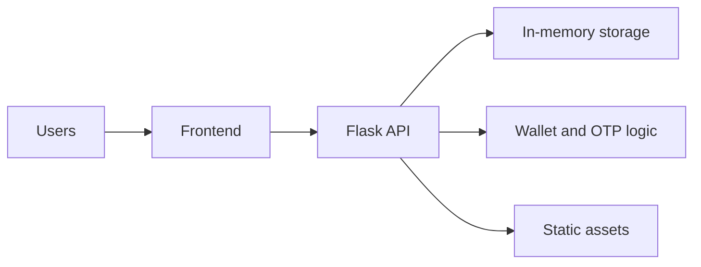

# HopDrop

## Live Demo
https://hopdrop-gbxk.onrender.com

HopDrop is a crowd-powered smart parcel delivery prototype for the Mangaluru-Karkala corridor. It models how trusted travelers can carry packages along routes while senders and receivers verify handoffs with OTPs and proof photos.

## Why it matters
- Uses existing travel to reduce delivery friction and cost.
- Adds lightweight trust controls (deposit lock, OTPs, proof photos).
- Demonstrates a realistic, end-to-end logistics workflow.

## Feature highlights
- Role-based flows for Sender, Traveller, and Receiver.
- Wallet model with deposit lock and reward payout.
- Per-package pickup and delivery OTP verification.
- Proof photos for pickup and delivery.
- Region-limited address autocomplete.
- WhatsApp share flows for real-world notifications.
- Render-ready deployment configuration.

## Architecture overview


## Workflow
### Sender
1. Register or sign in.
2. Create a package with pickup and delivery details.
3. Receive pickup and delivery OTPs.
4. Share the delivery OTP with the receiver.
5. Pay the reward after delivery.

### Traveller
1. Browse available packages on a route.
2. Accept a package (deposit is locked in the wallet).
3. Confirm pickup with the pickup OTP.
4. Complete delivery with the delivery OTP.

### Receiver
1. Track by package ID or phone number.
2. View status updates and proof photos.

## Local development
```bash
pip install -r requirements.txt
python backend/app.py
```
Open http://127.0.0.1:5000

## Deployment (Render)
- render.yaml configures the service and health check at /health.
- runtime.txt pins the Python version for consistent builds.
- The frontend uses same-origin API calls, so no host changes are needed.

## API summary
### Auth
- POST /register
- POST /login

### Sender
- POST /create-package
- GET /sender-packages?phone=...
- POST /pay-package

### Traveller
- GET /match-packages?route=...
- POST /accept-package
- POST /confirm-pickup
- POST /complete-delivery
- POST /cancel-delivery
- GET /wallet/<name>
- POST /top-up
- POST /verify-identity

### Receiver
- GET /package/<id>
- GET /receiver-packages?phone=...
- GET /packages

## Screenshots
Place screenshots in docs/screenshots/ and update this section:
- landing.png
- sender-flow.png
- traveller-flow.png
- receiver-tracking.png
- payment-confirmation.png

## Project structure
```
hopdrop/
  backend/
    app.py
  frontend/
    index.html
    dashboard.html
    sender.html
    traveller.html
    receiver.html
    styles.css
    session.js
    autocomplete.js
    three-bg.js
  legacy/
    backend/
    frontend/
  docs/
    screenshots/
```

## Notes and limitations
- All data is stored in memory and resets when the server restarts.
- Payments are simulated for demo purposes.
- Legacy FastAPI/Firebase prototypes are preserved in legacy/ for reference.
